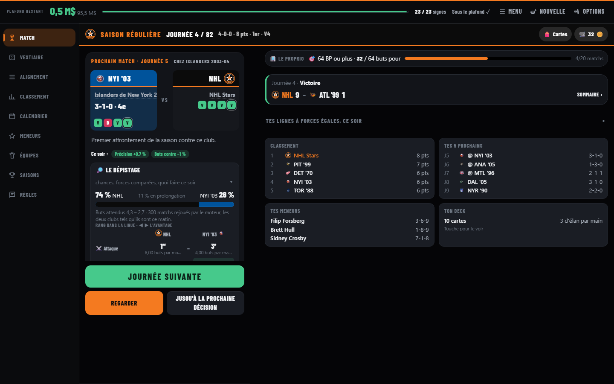
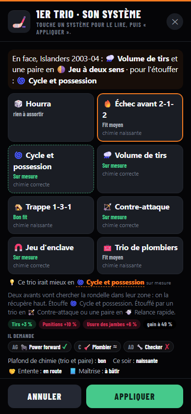
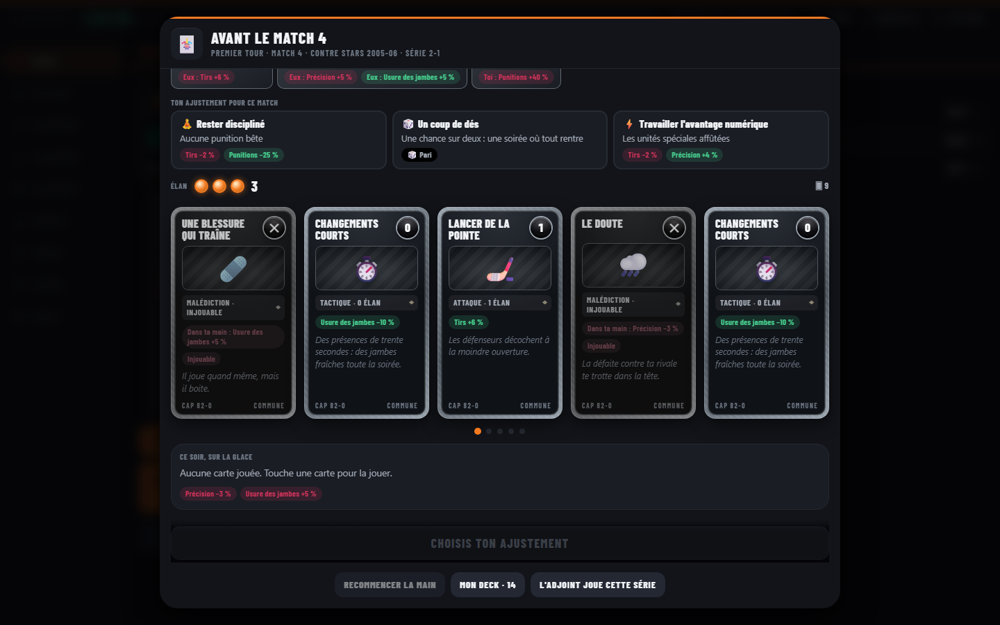
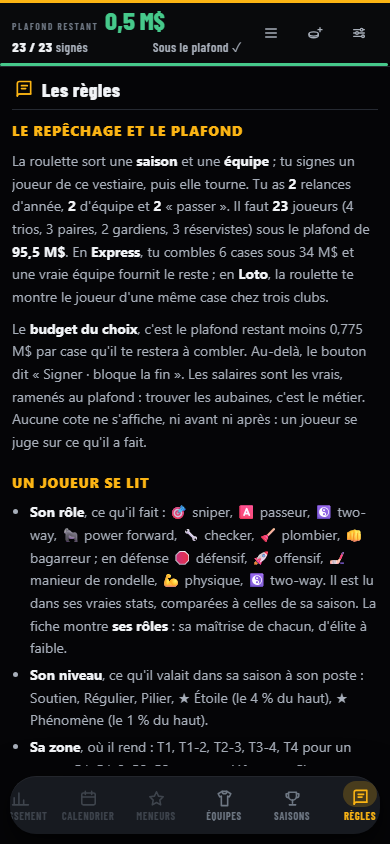

# Cap 82-0

Bâtis un alignement de 23 joueurs de la LNH — n'importe quelle saison depuis 1970-71, n'importe quelle équipe y compris les franchises disparues — sous le plafond salarial, et vois si ta formation peut faire une saison parfaite.

Chaque tour, la roulette sort une saison et une équipe. Tu piges dans ce vestiaire-là. Tu vois les vraies stats et le salaire. Aucune cote ne s'affiche, ni avant ni après : un joueur se juge sur ce qu'il a fait, et la simulation joue lancer par lancer sur ses vraies colonnes.

## La boucle, façon deckbuilder

- **Ton identité** : avant le premier tour, une carte parmi trois oriente la roulette (francs-tireurs, costauds, aubaines, jeunesse…).
- **Le repêchage** : vestiaire (une équipe entière) ou loto (le même joueur de trois clubs), dans toutes les époques, dans la saison de la ligue, ou dans **l'histoire d'une franchise** (relocalisations comprises).
- **Le mode Rogue** : une run de plusieurs saisons. Tu pars avec des plombiers et 40 jetons ; la boutique vend des packs ; chaque saison, le proprio en veut plus, et ton équipe se défait : tu n'en gardes que quelques joueurs. Écussons, jalons et cartable débloquent la suite d'une run à l'autre.
- **La saison** : tes lignes, leur système et leur chimie qui s'apprend ; les jambes de tes joueurs et de tes gardiens ; des dilemmes tirés d'histoires vraies ; aux journées 20, 40 et 60, la **main de la journée** en plein écran — un effet, un vrai joueur au choix, une amélioration, un nouveau rôle, un stage de système, le ménage du deck.
- **Les gros matchs et les séries** : un **deck de match** (50 cartes, de commune à légendaire, et des malédictions). Cinq cartes, trois d'élan ; l'adversaire joue aussi sa main, connue d'avance. Les victoires font grandir le deck, et les cartes de club paient les vrais coéquipiers, la même franchise, une vraie ligne d'origine.
- **L'album** : d'une partie à l'autre, les cartes eues, les identités essayées, et le cartable des joueurs — les champions de la Coupe en holographique.
- **Sur table** : le même alignement, joué comme un jeu de plateau à la Blood Bowl.

## Jouer

Le jeu est un site statique qui se joue en local. Aucun compte, aucun serveur distant.

```bash
python3 scripts/build_shards.py --seed-only   # ~10 saisons, 2 minutes
python3 -m http.server 8000
```

Ouvre http://localhost:8000. Les modules ES exigent `http://`, pas `file://`.

L'écran est celui d'un directeur général : la jauge de plafond et le budget par case restante en haut, la roulette et le tableau de bord dessous, puis le vestiaire et l'alignement. Le vestiaire se range par position — une colonne par poste sur grand écran, des sections empilées sur téléphone. Sur téléphone, vestiaire et alignement se prennent par onglets ; sur écran large, l'alignement reste sous les yeux. Chaque carte dit l'essentiel : le poste, le salaire, le chiffre clé, le rôle, la zone d'efficacité et la case où le joueur irait. Un clic ouvre sa fiche complète — statistiques détaillées, salaire d'époque, pénalité de position et effet sur ton alignement.

Pour la base complète — 1970-71 à aujourd'hui, tout joueur à 10+ matchs :

```bash
python3 scripts/build_shards.py
```

Environ 120 requêtes à l'API officielle de la LNH, 5 minutes. Requiert Python 3 et Node 18+, aucune dépendance à installer.

Pour refaire seulement la cote globale, les salaires, les archétypes et les zones (aucun réseau, une seconde) :

```bash
python3 scripts/build_shards.py --rerate
node scripts/check_ratings.mjs      # distribution des cotes et cohérence avec les vrais classements
```

## En images (1.0)

| Le bureau | Un système, en fenêtre |
|---|---|
|  |  |

| La main d'un match de séries | Les règles |
|---|---|
|  |  |

## Android et bureau

Le jeu n'est plus publié en ligne : il se joue en local, dans le navigateur, sur Android (`mobile/`, Capacitor) ou sur Windows (`desktop/`, Electron).

```powershell
powershell -ExecutionPolicy Bypass -File mobile\fabriquer-apk.ps1   # l'APK signé, dans mobile\Cap-82-0.apk
```

`mobile/assembler-www.mjs` regroupe et minifie le jeu (esbuild, devDependency de `mobile/` seulement) ; les salaires et le filet `data/seed.json` restent hors de l'APK.

La GitHub Action « Bâtir les données » existe encore pour régénérer les shards depuis l'API de la LNH (modes `full`, `bios`, `rerate`, `seed`) ; en local, `scripts/build_shards.py` fait la même chose.

**L'application Android** (`mobile/fabriquer-apk.ps1`) n'emporte pas les 3 900 visages recadrés (57 Mo) : l'APK n'a que les écussons et la silhouette. Au premier lancement, en arrière-plan, l'appareil télécharge chaque portrait au site de la LNH, le recadre lui-même avec le code de `scripts/portraits.mjs` (`js/recadrage.js`) et le garde dans son cache (`js/visages.js`). En attendant, la photo brute de la LNH s'affiche ; hors ligne, la silhouette. Le jeu marche hors ligne dès que cette passe est faite.

## Comment les cotes sont calculées

Elles sont dérivées des vraies stats, pas inventées, et **normalisées par saison**. Chaque joueur est mesuré en z-score contre ses contemporains. C'est ce qui fait que 100 points en 1982 et 100 points en 2004 ne donnent pas la même cote offensive — sinon les années 80 écraseraient tout.

| Cote | Dérivée de |
|---|---|
| Offensive | points/match, tirs/match, points en avantage numérique |
| Défensive | +/-, points en désavantage, temps de glace, tirs bloqués, bonus positionnel pour les défenseurs |
| Robustesse | minutes de punition/match, mises en échec (2005+) |
| Clutch | buts gagnants et en prolongation |

Gardiens : Technique (% d'arrêts), Blindage (moyenne de buts alloués), Robustesse (charge de travail), Clutch (blanchissages, % de victoires).

La cote globale ajoute un bonus de vedette calculé sur le rang du joueur dans sa saison, divisé par le nombre d'équipes de la ligue cette année-là : un top-10 des marqueurs vaut la même chose en 1975 qu'en 2024. Les 100+ points de l'ère moderne tombent entre 88 et 99.

Le salaire suit un barème par cote globale sur le plafond de 95,5 M$ (cote 70 → 2,3 M$, 80 → 5,6 M$, 88 → 11,5 M$, 99 → 18,5 M$). Un joueur de 100+ points coûte 12 à 18 M$, un défenseur de première paire 9 à 14 M$, et le premier contrat d'un joueur de 24 ans ou moins est un contrat d'entrée plafonné selon l'époque (rien avant 1995-96, base + bonis ensuite). Quand un salaire réel publié existe (`data/salaries/`), il remplace le barème au prorata du plafond de l'année ; pour 1989-90 à 2003-04, le « plafond » est la masse salariale de l'équipe la plus dépensière.

Chaque joueur porte aussi un archétype classique (franc-tireur, fabricant de jeu, attaquant de puissance, défenseur offensif…) et une zone d'efficacité (calibre 1er, 2e, 3e ou 4e trio) : un trio où tout le monde est dans sa zone gagne un bonus de chimie.

## La simulation

Une ligue complète : ta formation plus 31 vraies équipes historiques (tirées des saisons sorties par la roulette, alignées automatiquement), 82 matchs chacune, 1 312 matchs. Les trios comptent 34/28/22/16 %, les paires 40/34/26 % — ton quatrième trio pèse pour vrai. Le partant prend environ 68 départs.

Buts tirés d'une loi de Poisson autour d'espérances calculées depuis l'attaque, la brigade défensive et le gardien, avec une part de chance par match et un « PDO » d'équipe pour la saison. Un match sur quatre est éreintant, où la robustesse d'équipe ajuste la défensive. Les égalités passent en prolongation, tranchée par le clutch. Un trio qui reste intact gagne en continuité ; un joueur qui a raté des matchs dans sa vraie saison se blesse plus souvent et laisse sa place à un réserviste. Buts et passes sont distribués selon la vraie production de chaque joueur cette année-là. Classement, meneurs, infirmerie, puis séries 4 de 7 pour les 16 premiers.

Avec 23 joueurs de cote uniforme contre la moyenne de la ligue : cote 60 donne 53-26-4, cote 70 donne 69-12-1, cote 99 donne 81-1-0. Même une équipe parfaite perd en moyenne un match. Le 82-0 reste rare, c'est voulu.

## Documentation

- [CLAUDE.md](CLAUDE.md) — conventions et règles pour les agents de code
- [AGENTS.md](AGENTS.md) — même chose, pour Jules et compagnie
- [ARCHITECTURE.md](ARCHITECTURE.md) — pourquoi le découpage par saison, les trois sources de données
- [LIVRAISON.md](LIVRAISON.md) — le plan de travail vers la 1.0
- [PLAN.md](PLAN.md) — état du projet, ce qui reste à faire
- [docs/](docs/README.md) — l'historique : décisions, référence du moteur, journal par sprint

## Données

Source : API publique de la LNH (`api.nhle.com/stats/rest`). Non affilié à la LNH.
